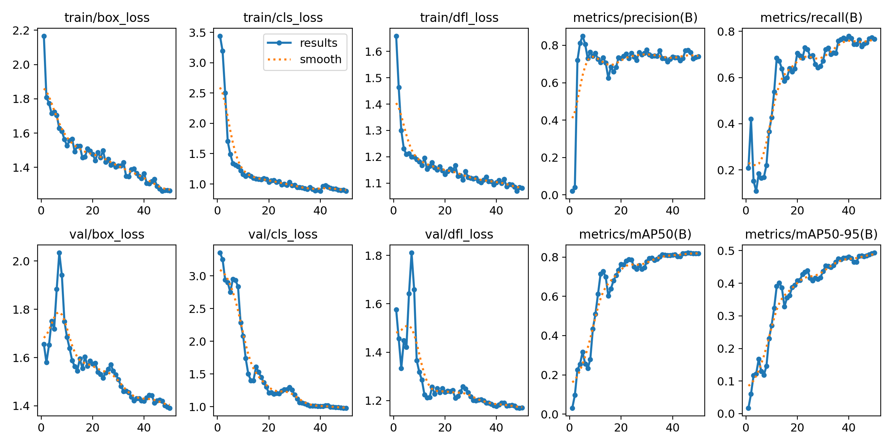
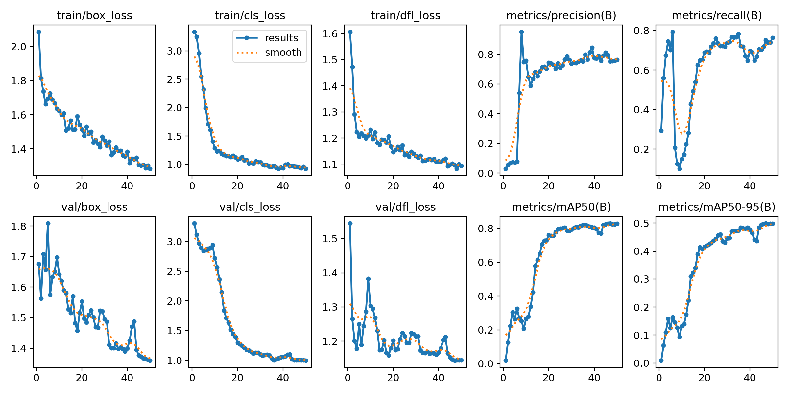
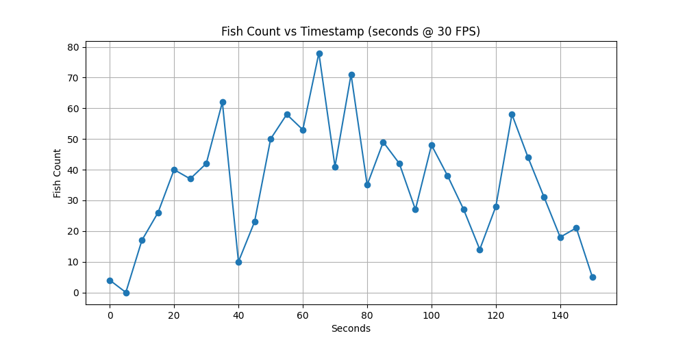

# MATE ROV 2025 Computer Vision Challenge
CWRUbotix's solution to the 2025 [MATE ROV / Ocean Exploration Video Challenge](https://20693798.fs1.hubspotusercontent-na1.net/hubfs/20693798/2025%20MATE%20ROV%20Ocean%20Exploration%20Video%20Challenge%20Final.pdf).

## Introduction & Methods
In response to MATE II's 2025 *Ocean Exploration Video Challenge*, CWRUbotix conducted a review of object detection models. Many fish detection and tracking models already exist in the literature[^1]. Most current models target more controlled operating environments to obtain higher tracking accuracy[^2][^3][^4] or use density-based[^5] count estimation, and therefore do not satisfy MATE II's requirements. We identified YOLO-Fish[^6] (which fine-tunes DarkNet's YOLOv3 implementation for fish detection using the [DeepFish](https://alzayats.github.io/DeepFish/) and [OzFish](https://github.com/open-AIMS/ozfish) datasets) as one good candidate model for detection in MATE II's unconstrained operating environment.

We qualitatively evaluated the performance of the trained YOLO-Fish network on the provided video sample using DarkNet and DarkHelp, and determined that although it had too many false negatives for submission, its output would be a good stepping stone in creating a labeled dataset from the video. We used the output of YOLO-Fish and the Roboflow labeling platform to create the dataset. Our code for running YOLO-Fish is available [here](https://github.com/CWRUbotix/YOLO-Fish) (note: this is ***not*** our final model!).

TODO: EXAMPLE DARKNET FRAMES
TODO: DARKNET INSTALLATION INSTRUCTIONS

Considering the decent performance of YOLO-Fish and our team's past experience with YOLO networks, we chose to fine tune YOLOv8 and YOLOv11 nano models on our labeled dataset. We also trained an EfficientDet model, a network often used to compare with YOLO networks. We partitioned our dataset with a 60%/20%/20% training/validation/testing split and resized the video frames to 640x640. We trained the YOLO networks for 50 epochs with a batch size of 16 on an NVIDIA 4070 graphics card. As per *Table I*, we achieved a mean average precision of roughly 0.8 for both YOLO models at an IoU of 0.5, dropping to roughly 0.5 at higher IoUs. Our YOLO models therefore performed far better than YOLO-Fish (at 0.43 mAP 50 and 0.3 mAP 50-95 measured on our test split). EffDet drastically underperformed in testing.

| Model     | mAP 50 | mAP 50-95 |
| --------- | ------ | --------- |
| YOLO v8n  | 0.8187 | 0.4936    |
| YOLO v11n | 0.8279 | 0.4979    |
| EffDet    | 0.0905 | 0.0358    |
| YOLO-Fish | 0.4347 | 0.2950    |
*Table I: Mean average precision values for our models.*


*Figure I: Metrics during YOLOv8 training*


*Figure II: Metrics during YOLOv8 training*

As per *Table II*, inference time for the YOLO models is close to 10ms/frame, with YOLO v8 performing slightly better.

| Model     | Inference Time (1 frame) | Full frame inference & write time |
| --------- | ------------------------ | --------------------------------- |
| YOLO v8n  | 11.2ms                   | 92.6ms                            |
| YOLO v11n | 8.5ms                    | 90.3ms                            |

We chose to submit our YOLO v11 model to the competition. *Figure III* graphs the fish predictions every 5 seconds from this model on the provided video.


*Figure III: Graph of fish counts over time*


## Usage
### Setup
 1. Install [CUDA 12.1](https://developer.nvidia.com/cuda-12-1-0-download-archive). Note that this version of CUDA is outdated. Our code may work on up-to-date CUDA, but it was only tested on 12.1.
 2. Install the Python dependencies (Torch and Ultralytics) by running

```bash
pip install --user torch==2.5.1 torchvision==0.20.1 torchaudio==2.5.1 --index-url https://download.pytorch.org/whl/cu121
pip install --user ultralytics
```

### Predicting
To predict on a video, run the following command:

```bash
python predict.py -v path/to/your/video.mp4
```

i.e. if you move your video into our repo directory:

```bash
python predict.py -v video.mp4
```

Videos should be 30 FPS for accurate graphing and 1920x1080 to avoid distortion in the annotated video. The model's outputs (annotated video, CSV of fish counts, and graph of fish counts) will appear in the `output/` directory.

You may also select different model weights:

```bash
python predict.py -v video.mp4 -m weights/yolov8-finetuned.pt
```

### Training
To train a YOLOv11 model on the data in `dataset/`, run:

```bash
python train.py
```

Replace the `dataset/images/` and `dataset/labels/` directories with your own data to train for a different application. Edit the `train.py` file to use a different YOLO version.

# Misc
EfficientDet model can be found for download here: https://huggingface.co/ktm06/efficientdet-fishclassification-v1


[^1]: Cui, M., Liu, X., Liu, H., Zhao, J., Li, D. and Wang, W. (2025), Fish Tracking, Counting, and Behaviour Analysis in Digital Aquaculture: A Comprehensive Survey. Rev Aquac, 17: e13001. [https://doi.org/10.1111/raq.13001](https://doi.org/10.1111/raq.13001)

[^2]: P. L. F. Albuquerque, V. Garcia, A. d. S. O. Junior, et al., "Automatic Live Fingerlings Counting Using Computer Vision," Computers and Electronics in Agriculture 167 (2019): 105015.

[^3]: G. Xu, Q. Chen, T. Yoshida, et al., "Detection of Bluefin Tuna by Cascade Classifier and Deep Learning for Monitoring Fish Resources," in Global Oceans 2020 (Singapore–US Gulf Coast: IEEE, 2020), 1–4.

[^4]: S. M. D. Lainez and D. B. Gonzales, "Automated Fingerlings Counting Using Convolutional Neural Network," in 2019 IEEE 4th International Conference on Computer and Communication Systems (ICCCS) (Singapore: IEEE, 2019), 67–72.

[^5]: N. Liu, Y. Long, C. Zou, Q. Niu, L. Pan, and H. Wu, "Adcrowdnet: An Attention-Injective Deformable Convolutional Network for Crowd Understanding," in Proceedings of the IEEE/CVF Conference on Computer Vision and Pattern Recognition, Long Beach, CA (2019), 3225–3234.

[^6]: A. A. Muksit, F. Hasan, Md. F. Hasan Bhuiyan Emon, M. R. Haque, A. R. Anwary, and S. Shatabda, "YOLO-Fish: A robust fish detection model to detect fish in realistic underwater environment," Ecological Informatics, vol. 72, p. 101847, 2022, doi: https://doi.org/10.1016/j.ecoinf.2022.101847.
